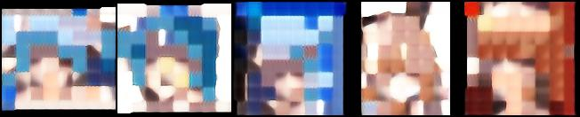
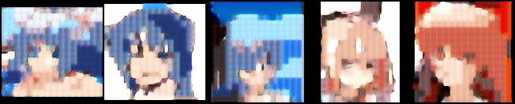
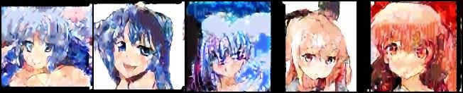

# Quantized-Autoregression-Image-Generator
## Description
This is an experimental project to prove whether simple model(s) comprising a Fully Convolution Autoencoder, Self-Organizing Map style codebooks, and a cascade of Transformer models can generate discretized images. It foregoes algorithms used in diffusion models, adversarial training in GANs and others in favour of next-token prediction used in Large Language Models(LLMs) to generate discretized patches of images.

## How it works
The project implements a series of Machine Learning models including:
- Fully Convolution Autoencoder model
- Self-Organizing Maps (SOM)
- Transformer model(s)

### Fully Convolution Autoencoder
This model is trained with the simple task of reconstructing the image. It is composed of an Encoder and Decoder sections of Fully Convolution layers. The encoder section can be used to encode images into a continuous **Latent/Feature Map** which has a small dimension size than the image while the decoder section can be used to decode the latent map back into a reconstructed version of the image.

### Self-Organizing Maps (SOM)
Here the **Latent/Feature Map** from the Encoder section is split into patches of varying sizes. For example a feature map (C,H,W) is reshaped into a number ((H / P) * (W / P)) of flattened patches of dimension (P * P * C) where H is the height, W is the width, and C is the channel size of the feature map and P is the size of patches. A **Self-Organizing Map** is then applied to the continuous sequence of flattened patches of the feature map to generate a discretized codebook of these patches. 

**NOTE**: My implementation of this algorithm slightly differs from the original, and is closer to a KNN in certain parts.

### Transformer model(s)
The continuous patches from the **Latent Map** can be discretized by computing the Best Matching Unit(BMU), closest unit in the codebook to an each patch's vector. The index of the selected BMU in the codebook is then used as input in a **Transformer** model. The **Transformer** model is trained similarly to how most Large Language Models (LLMs) are trained, to predict the next token using previous token as context. Instead of the tokens representing characters, sub-words or words, they represent discrete patches of **Feature Map** in the codebook.

A cascade of **Transformer** models is used in this project. At the start, a simple **Decoder-only Trasformer** model is trained on coarse-detailed inputs generated when the patch size is large, meaning a lot of information is lost when they are discretized. A special token is appended at the start of the sequence of input tokens to act as conditional input. This is obtained from a codebook generated using flattened **Feature Map**s used in their entirety as input in **Self-Organizing Map**s. For each succeeding model in the cascade, an **Encoder-Decoder Transformer** model is used. The output from the preceeding model will be passed to the **Encoder** section of the model and a finer-detailed input generated when the patch size is small, meaning less information if lost when they are discretized, is passed into the **Decoder** section. The output of the **Encoder** will now act as conditional information for the Decoder to use to predict the most probable next token.

To improve the quality of the next-token prediction, optional Beam seach algorithm and Temperature parameter is implemented. 

This should slowly reconstruct a discretized version of the image.


### Example of generated output
I was able to train a model using [Danbooru2017](https://gwern.net/danbooru2021#danbooru2017) dataset.

**NOTE**: Each of the images was generated from taking the sequences of discrete patches, reshaping them back into a **Feature Map** and passing them into the **Decoder**.

**Conditonal input for Base Model**:


**Output from Base Model**:



**Output from Cascade Model 1**:



**Output from Cascade Model 2**:



## Requirements
- Anaconda (Optional)
- Python 3

## Installing
1. (Optional) Install [Anaconda](https://docs.anaconda.com/) on your machine.
    - Create anaconda environment:
    ```
    conda create --name <env_name> python=3.12
    ```
    - To activate anaconda environment, if not already activated:
    ```
    conda activate <env_name>
    ```
2. (If not installed) Install [Pytorch 2.5](https://pytorch.org/get-started/locally/) based on your hardware requirements and preferences.
3. Install Python depencies:
    ```
    pip install -r requirements.txt
    ```

## Training Model(s)
### Autoencoder
Ensure there's a dataset.json file for the dataset that looks like this:
```
{"_default": {"1": {"image_fpath": "<filepath>", "labels": []},...}
```
and there's a config.json that looks like this:
```
{
    "model_lr": 1e-5,
    "image_channel": 3,
    "min_channel": 256,
    "max_channel": 512,
    "num_layers": 2,
    "latent_channel": 4,
    "hidden_activation_type": "silu",
    "use_final_enc_activation": true,
    "encoder_activation_type": "tanh",
    "use_final_dec_activation": true,
    "decoder_activation_type": "tanh"
}
```

#### Usage
```
python train_autoencoder.py [options]
```

#### Example
```
python train_autoencoder.py --device cpu --dataset-path "<Filepath to dataset.json file>" --batch-size 8 --checkpoint-step 1000 --lr-step 50000 --max-epoch 1 --config-path "<Filepath to config.json>" --out-dir "<Output directory for model checkpoints and logs>"
```

### Generate Feature Maps dataset
Run the following script to use the Encoder layer to generate stand-alone Feature maps dataset.

#### Usage
```
python generate_fmap_dataset.py [options]
```

#### Example
```
python generate_fmap_dataset.py --device cpu --batch-size 64 --num-files-folder 1000 --dataset-path "<Filepath to image dataset.json>" model-path "<Filepath to saved autoencoder model checkpoint>" --out-dir "<Filepath to output directory of new created dataset.json>"
```

### Self-Organizing Map (SOM)
Ensure there's a config.json file that looks like this:
```
{
    "model_lr": 1e-4,
    "image_H": 32,
    "image_W": 32,
    "image_C": 4,
    "patch_H": 8,
    "patch_W": 8,
    "num_embeddings": 512,
    "neighbourhood_step": 200
}
```

#### Usage
```
python train_codebook.py [options]
```

#### Example
```
python train_codebook.py --device cpu --dataset-path "<Filepath to feature map dataset.json file>" --decoder-path "<Filepath to saved Autoencoder model's checkpoint>" --batch-size 8 --checkpoint-step 1000 --lr-step 50000 --max-epoch 1 --config-path "<Filepath to config.json>" --out-dir "<Output directory for codebook and logs>"
```

### Pruning Codebook
Remove under-utilized codebook's units.

#### Usage
```
python prune_codebook.py [options]
```

#### Example
```
python prune_codebook.py --device cpu --dataset-path "<Filepath to feature map dataset.json file>" --codebook-path "<Filepath to saved codebook>" --batch-size 64 --prune-threshold 1000 --out-dir "<Output directory for pruned codebook and logs>"
```

### Transformer
Ensure there's a config.json file that looks like this:
```
{
    "model_lr": 1e-4,
    "use_sliding_window": true,
    "sliding_window": 256,
    "num_enc_layers": 5,
    "num_dec_layers": 7,
    "self_attn_heads": 64,
    "cross_attn_heads": 64,
    "in_dim": 512,
    "hidden_dim": 2048,
    "hidden_activation": "silu"
}
```

#### Usage
python train_quantized_transformer.py [options]

#### Example
```
python train_quantized_transformer.py --device cpu --dataset-path "<Filepath to feature map dataset.json file>" --train-base-model --decoder-path "<Filepath to saved Autoencoder model's checkpoint>" --lr-codebook-path "<Filepath to saved Low-Resolution Codebook>" --hr-codebook-path "<Filepath to saved High-Resolution Codebook>" --test-num-sample 8 --batch-size 64 --temperature 0.7 --checkpoint-step 1000 --lr-step 50000 --max-epoch 1 --use-activation-checkpoint --config-path "<Filepath to config.json>" --out-dir "<Output directory for model checkpoints and logs>"
```

### Generating Images
Ensure there's a config.json file that looks like this:
```
{
    "0": {
        "model_path": "<Filepath to saved Base Transformer model's checkpoint>",
        "lr_codebook_path": "<Filepath to saved Base Low-Resolution Codebook>",
        "hr_codebook_path": "<Filepath to saved Base High-Resolution Codebook>",
        "beam_width": 16,
        "num_beam": 32,
        "temperature": 1.5
    },
    "1": {
        "model_path": "<Filepath to saved Cascade-1 Transformer model's checkpoint>",
        "lr_codebook_path": "<Filepath to saved Cascade-1 Low-Resolution Codebook>",
        "hr_codebook_path": "<Filepath to saved Cascade-1 High-Resolution Codebook>",
        "beam_width": 8,
        "num_beam": 4,
        "temperature": 1.0
    },
    "2": {
        "model_path": "<Filepath to saved Cascade-2 Transformer model's checkpoint>",
        "lr_codebook_path": "<Filepath to saved Cascade-2 Low-Resolution Codebook>",
        "hr_codebook_path": "<Filepath to saved Cascade-2 High-Resolution Codebook>",
        "beam_width": 8,
        "num_beam": 4,
        "temperature": 1.5
    }
}
```

#### Usage
python generate_images.py [options]

#### Example
```
python generate_images.py --device cpu --decoder-path "<Filepath to saved Autoencoder model's checkpoint>" --num-images 5 --seed 69 --config-path "<Filepath to config.json>" --out-dir "<Output directory where images will be saved>"
```

## Learning Resources
- [Attention Is All You Need](https://arxiv.org/abs/1706.03762)
- [Visual Autoregressive Modeling: Scalable Image
Generation via Next-Scale Prediction](https://arxiv.org/abs/2404.02905)
- [An Image is Worth 16x16 Words: Transformers for Image Recognition at Scale](https://arxiv.org/abs/2010.11929)
- [Scalable Diffusion Models with Transformers](https://arxiv.org/abs/2212.09748)
- [Self-Organizing Map](https://www.saedsayad.com/clustering_som.htm)
- [High-Resolution Image Synthesis with Latent Diffusion Models](https://arxiv.org/abs/2112.10752)
- [Cascaded Diffusion Models
for High Fidelity Image Generation](https://arxiv.org/abs/2106.15282)
- [[LLM Temperature](https://www.hopsworks.ai/dictionary/llm-temperature)]
- [Beam Search Algorithm](https://www.width.ai/post/what-is-beam-search)